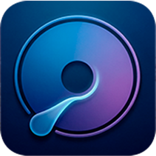
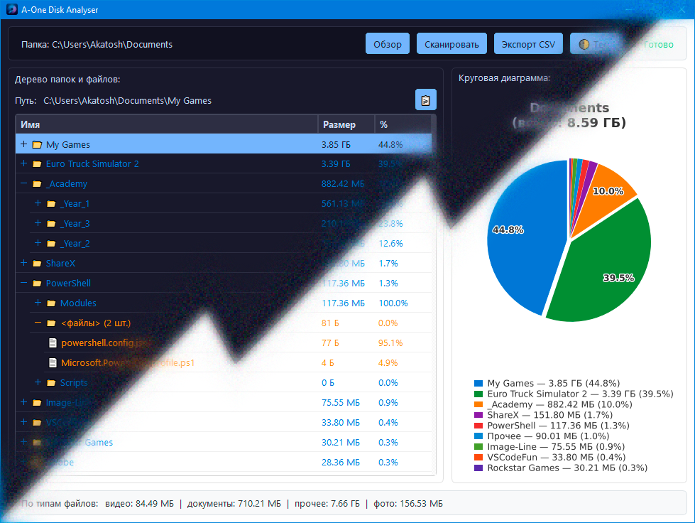

<div align="center">



# 📁 A-One Disk Analyser

[](https://python.org) [](https://doc.qt.io/qtforpython-6) [](https://matplotlib.org) [](https://www.gnu.org/licenses/gpl-3.0)

</div>

## 📖 Обзор проекта

**A-One Disk Analyser** - это настольный инструмент для анализа использования дискового пространства на локальных накопителях или в выбранных папках. Программа позволяет быстро сканировать большие директории, рассчитывать размеры папок и файлов, классифицировать файлы по типу и визуализировать данные с помощью круговой диаграммы.

Приложение имеет современный пользовательский интерфейс на основе `PySide6`, поддерживает работу в режиме минимизации в системном трее и обеспечивает удобный просмотр структуры данных в древовидном представлении.

<br>

## ✨ Ключевые особенности

* 🕵️ **Глубокий анализ:** Сканирование всех папок и файлов выбранного пути, включая учет размеров на уровне директорий.
* 📊 **Визуализация данных:** Интерактивная круговая диаграмма для отображения распределения занятого места по крупнейшим папкам.
* 🌲 **Древовидное представление:** Удобный иерархический список файлов и папок с указанием их размеров и процентного соотношения от общего объема.
* 🎨 **Темы оформления:** Поддержка светлой и тёмной тем с переключением в один клик.
* 💾 **Экспорт данных:** Возможность экспорта результатов сканирования в формате CSV.
* 🖥️ **Системный трей:** Работа в фоновом режиме через значок в системном трее.
* 🎯 **Цветовая индикация:** Папки и файлы подсвечиваются разными цветами для удобной навигации.

## 📋 Требования (Prerequisites)

Для запуска или сборки проекта вам потребуется установленный Python (рекомендуется Python 3.8+).

### 📦 Зависимости

Проект использует следующие внешние библиотеки:

* `PySide6`: Для создания современного GUI на базе Qt.
* `matplotlib`: Для построения круговой диаграммы.

## 🛠️ Установка и настройка (Installation)

Рекомендуется использовать виртуальное окружение (`venv`) для изоляции зависимостей проекта.

### 📥 Шаг 1: Клонирование репозитория

```bash
git clone https://github.com/statosh/A-One-Disk-Analyser
cd A-One-Disk-Analyser
```

### 🔧 Шаг 2: Создание и активация виртуального окружения (рекомендуется)

```bash
python -m venv venv
.\venv\Scripts\activate
```

### ⚙️ Шаг 3: Установка зависимостей

```bash
pip install -r requirements.txt
```

## 🚀 Запуск приложения (Running)

После установки зависимостей вы можете запустить приложение напрямую:

```bash
python main.py
```

## 🔨 Сборка исполняемого файла (Building the Executable)

Поскольку код содержит логику для работы в замороженном состоянии (`sys._MEIPASS`), проект предназначен для сборки в автономный исполняемый файл (например, `.exe` для Windows). Для этого используется **PyInstaller**.

### 📦 Шаг 1: Установка PyInstaller

```bash
pip install pyinstaller
```

### 🏗️ Шаг 2: Сборка проекта

Для корректной работы приложения при сборке вам необходимо убедиться, что в папке `img/` находится значок `icon.ico`, а в папках `ui/` и `style/` — соответствующие файлы.

```bash
pyinstaller --onefile --windowed main.py --add-data "ui;ui" --add-data "style;style" --add-data "img;img"
```

После выполнения команды исполняемый файл будет находиться в папке `dist/`.

## 📁 Структура проекта (Code Structure)

* `main.py`: Основной класс приложения (`DiskAnalyzerApp`), управление UI (PySide6), обработка событий и интеграция всех компонентов.
* `scanner.py`: Модуль сканирования диска. Отвечает за рекурсивный обход файловой системы, подсчет размеров папок/файлов и классификацию файлов в многопоточном режиме (`threading`).
* `chart.py`: Построение круговой диаграммы с использованием Matplotlib и её интеграция в Qt виджет.
* `export.py`: Функции для сохранения результатов сканирования в структурированный CSV-файл.
* `ui/main_window.ui`: Файл интерфейса, созданный в Qt Designer.
* `style/base.qss`: Базовые стили приложения.
* `style/light.qss`: Стили светлой темы.
* `style/dark.qss`: Стили тёмной темы.